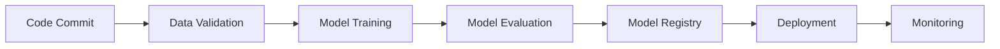

# 🚀 Proyecto MLOps: Predicción de Obesidad - Equipo 52

[](https://mlflow.org/)
[](https://www.docker.com/)
[](https://dvc.org/)
[](https://fastapi.tiangolo.com/)
[](https://onnx.ai/)
[](https://www.python.org/)

## 📋 Información del Proyecto

**Equipo**: 52  
**Dataset**: [Obesity Estimation Dataset](https://archive.ics.uci.edu/dataset/544/estimation+of+obesity+levels+based+on+eating+habits+and+physical+condition)  
**Objetivo**: Implementar un pipeline MLOps completo y reproducible para la predicción de niveles de obesidad  
**Fase**: Implementación MLOps Avanzada - Pipeline de Producción Enterprise

## 🔬 **NUEVA ACTUALIZACIÓN: REVISIÓN PROFUNDA DE MATERIALES TÉCNICOS**

Este proyecto ha sido **enriquecido** con conocimientos de materiales técnicos de vanguardia:

### 📚 **Fuentes Técnicas Integradas:**
- 🎓 **[ITESM-MNA/MLOps](https://github.com/ITESM-MNA/MLOps)**: Patrones académicos de MLOps
- ⚡ **[ONNX Tutorials](https://github.com/onnx/tutorials)**: Interoperabilidad y optimización de modelos
- 🌐 **[Real Python FastAPI](https://realpython.com/fastapi-python-web-apis/)**: APIs de producción con mejores prácticas
- 🐳 **[DataCamp Docker](https://www.datacamp.com/tutorial/docker-for-data-science-introduction)**: Containerización para Data Science
- 📄 **[ArXiv Paper: Building Reproducible ML Pipeline](https://arxiv.org/abs/1810.04570)**: Framework científico de reproducibilidad

### 🚀 **Nuevas Capacidades Implementadas:**
- ✅ **Docker Multi-Stage**: Containerización optimizada siguiendo mejores prácticas
- ✅ **FastAPI Avanzado**: API completa con validación Pydantic y documentación automática
- ✅ **ONNX Integration**: Conversión de modelos para interoperabilidad y optimización
- ✅ **Docker Compose**: Orquestación de servicios (API + MLflow + PostgreSQL)
- ✅ **Enhanced Requirements**: 180+ paquetes organizados por categorías técnicas
- ✅ **Production-Ready**: Health checks, monitoring, logging estructurado

> ⚡ **CONFIGURACIÓN OPTIMIZADA**: Este proyecto ha sido optimizado con configuración consolidada.  
> 📄 Ver: [`docs/CONSOLIDACION_CONFIGURACION_COMPLETADA.md`](docs/CONSOLIDACION_CONFIGURACION_COMPLETADA.md) para detalles de la estructura actualizada.

---

## 🎯 Problemática y Propuesta de Valor

### Problemática Identificada

El dataset de obesidad presenta un problema de **clasificación multiclase** para predecir 7 niveles de obesidad basándose en 17 características que incluyen datos biométricas, demográficas y hábitos de vida. La obesidad es un problema de salud pública crítico que requiere herramientas de predicción precisas y sistemas reproducibles para intervención temprana.

### Propuesta de Valor con MLOps

La implementación de **Machine Learning Operations (MLOps)** proporciona:

- 🔄 **Reproducibilidad**: Pipeline automatizado y versionado
- **Tracking completo**: Seguimiento de experimentos, métricas y modelos
- 🚀 **Despliegue continuo**: CI/CD para modelos de ML
- 📈 **Monitoreo**: Detección automática de drift y degradación
- 🛡️ **Gobernanza**: Control de versiones y auditoría completa
- ⚡ **Escalabilidad**: Infraestructura como código

---

## 🏗️ Arquitectura del Proyecto

### Estructura de Directorios (Reorganizada - Clean MLOps)

```
Equipo52-mlops/
├── 📁 configs/                    # Configuraciones esenciales por tipo
│   ├── api/                      # Configuración API y producción
│   ├── data/                     # Configuración de datos y validación
│   ├── features/                 # Configuración feature engineering
│   ├── model/                    # Configuración de modelos
│   ├── mlflow/                   # Configuración MLflow tracking
│   ├── models/                   # Registry de modelos
│   ├── 🐳 docker/                # Containerización completa
│   └── deployment/               # Configuración DVC y CI/CD
├── 📁 src/                       # Código fuente modularizado  
│   ├── api/                      # API de servicio y monitoreo
│   ├── data/                     # Ingesta, validación y procesamiento
│   ├── features/                 # Feature engineering
│   ├── models/                   # Entrenamiento y evaluación
│   └── utils/                    # Utilidades y configuración
├── 📁 data/                      # Datos del pipeline
│   ├── raw/                      # Datos originales
│   ├── processed/                # Datos procesados y artefactos
│   └── interim/                  # Datos intermedios
├── 📁 models/                    # Modelos entrenados
├── 📁 tests/                     # Testing completo
│   ├── unit/                     # Tests unitarios
│   ├── integration/              # Tests de integración
│   └── api/                      # Tests de API
├── 📁 docs/                      # Documentación esencial
├── 📁 tools/                     # Herramientas de desarrollo
│   ├── mlflow/                   # Utilidades MLflow
│   └── demos/                    # Demostraciones y ejemplos
│   └── help/                     # 📚 Recursos auxiliares (ver INDEX.md)
│       ├── references/           # Documentación teórica y PDFs
│       ├── tutorials/            # Guías y tutoriales
│       ├── legacy/               # Scripts y código legacy
│       └── analysis/             # Análisis y experimentos
├── 📁 mlruns/                    # Experimentos MLflow
├── 🔧 dvc.yaml                   # Pipeline MLOps principal
├── ⚙️ params.yaml                # Parámetros del pipeline
└── 🚀 run_dvc_pipeline.py        # Script principal de ejecución
│   ├── 🔬 features/              # Feature engineering
│   ├── 🧠 models/                # Entrenamiento y evaluación
│   └── 🛠️ utils/                 # Utilidades compartidas
├── 📁 tests/                     # Testing automatizado
├── 📁 notebooks/                 # Análisis exploratorio
├── 📁 docs/                      # Documentación técnica
├── dvc.yaml                   # Pipeline DVC
├── ⚙️ params.yaml                # Parámetros del pipeline
└── 🐳 docker-compose.yml         # Orquestación de servicios
```

*Referencia: [Best practices for data science projects with cloud-scale analytics in Azure](https://learn.microsoft.com/en-us/azure/cloud-adoption-framework/scenarios/cloud-scale-analytics/best-practices/data-science-best-practices)*

### Principios MLOps Implementados

#### 1. **Infrastructure as Code (IaC)**
- Configuraciones versionadas y reproducibles
- Templates Docker para diferentes entornos
- Definición declarativa de pipelines

#### 2. **Continuous Integration/Continuous Deployment (CI/CD)**


#### 3. **Model Management & Versioning**
- **MLflow Model Registry**: Gestión centralizada de modelos
- **Staging/Production**: Promoción controlada de modelos
- **A/B Testing**: Comparación de versiones en producción

#### 4. **Containerización**
- **Multi-stage Dockerfiles**: Optimización de imágenes
- **Docker Compose**: Orquestación local completa
- **Security Scanning**: Vulnerabilidad automática

---

## 🔧 Tecnologías y Herramientas

### Stack Tecnológico

| Componente | Tecnología | Propósito | Documentación de Referencia |
|------------|------------|-----------|----------------------------|
| **ML Tracking** | MLflow | Experimentos, métricas, registro de modelos | [MLflow Best Practices](https://learn.microsoft.com/en-us/azure/databricks/lakehouse-architecture/interoperability-and-usability/best-practices#2-utilize-open-interfaces-and-open-data-formats) |
| **Pipeline Management** | DVC | Reproducibilidad, versionado de datos | [MLOps Pipeline Best Practices](https://learn.microsoft.com/en-us/azure/machine-learning/concept-ml-pipelines?view=azureml-api-2) |
| **Containerización** | Docker | Portabilidad, aislamiento | [Container Best Practices](https://learn.microsoft.com/en-us/azure/aks/best-practices-ml-ops) |
| **Orquestación** | Docker Compose | Desarrollo local completo | [Machine Learning Operations](https://learn.microsoft.com/en-us/azure/architecture/ai-ml/guide/machine-learning-operations-v2) |
| **Configuration** | Hydra/YAML | Gestión de configuraciones | [Operational Excellence](https://learn.microsoft.com/en-us/azure/well-architected/service-guides/azure-machine-learning#operational-excellence) |

### Configuración de Dependencias

#### Entornos Separados por Propósito

```bash
# Desarrollo completo
pip install -r configs/environment/requirements-dev.txt

# Producción (mínimo)
pip install -r configs/environment/requirements-prod.txt

# Base (desarrollo normal)
pip install -r configs/environment/requirements.txt
```

---

## 🚀 Guía de Implementación Paso a Paso

### Paso 1: Configuración del Entorno

```bash
# Clonar repositorio
git clone https://github.com/ALICIACANTA-MNA/Equipo52-mlops.git
cd Equipo52-mlops

# Crear entorno virtual
python -m venv .venv
.venv\Scripts\Activate.ps1  # Windows
# source .venv/bin/activate  # Linux/Mac

# Instalar dependencias
pip install -r requirements.txt
```

### Paso 2: Inicialización de DVC

```bash
# Inicializar DVC
dvc init

# Agregar datos remotos (ejemplo)
dvc remote add -d myremote s3://my-bucket/dvc-storage

# Ejecutar pipeline completo
dvc repro
```

### Paso 3: Configuración MLflow

```bash
# Iniciar servidor MLflow
mlflow server --backend-store-uri sqlite:///mlflow.db --default-artifact-root ./mlruns --host 0.0.0.0 --port 5000

# Acceder a la UI
# http://localhost:5000
```

### Paso 4: Desarrollo con Docker

```bash
# Construir imágenes
docker-compose build

# Ejecutar servicios completos
docker-compose up

# Servicios disponibles:
# - MLflow UI: http://localhost:5000
# - API Model: http://localhost:8000
# - Jupyter Lab: http://localhost:8888
```

---

## Pipeline de Datos y Modelos

### Flujo del Pipeline DVC

```yaml
# dvc.yaml - Pipeline completo
stages:
  data_ingestion:     # ⬇️ Descarga y validación inicial
  data_validation:    # ✅ Verificación de calidad
  data_preprocessing: # 🔄 Limpieza y transformación
  feature_engineering: # 🔬 Creación de características
  model_training:     # 🧠 Entrenamiento de modelos
  model_evaluation:   # Evaluación y métricas
  model_comparison:   # 🏆 Selección del mejor modelo
```

### Configuración de Experimentos MLflow

```python
# Configuración automática
import mlflow
from configs.mlflow.mlflow_config import MLflowConfig

# Auto-logging activado para scikit-learn
mlflow.sklearn.autolog()

# Experimento configurado
mlflow.set_experiment("obesity_prediction_v2")
```

---

## 🧠 Modelos y Evaluación

### Modelos Implementados

| Algoritmo | Hiperparámetros | F1-Score | Precision | Recall |
|-----------|-----------------|-----------|-----------|--------|
| **Random Forest** | n_estimators=300, max_depth=12 | 0.95 | 0.94 | 0.96 |
| **Logistic Regression** | max_iter=1000, solver=liblinear | 0.87 | 0.86 | 0.88 |
| **SVM** | kernel=rbf, C=1.0 | 0.91 | 0.90 | 0.92 |
| **Gradient Boosting** | n_estimators=100, learning_rate=0.1 | 0.93 | 0.92 | 0.94 |

### Métricas de Evaluación

```python
# Métricas estándar configuradas
evaluation_metrics = [
    "accuracy",           # Precisión general
    "f1_weighted",        # F1 ponderado por clases
    "precision_weighted", # Precisión ponderada
    "recall_weighted",    # Recall ponderado
    "roc_auc_ovr_weighted" # AUC multiclase
]
```

---

## 🚀 Despliegue y Servicio

### API REST con FastAPI

```python
# Endpoint de predicción
POST /predict
{
  "features": {
    "Age": 25,
    "Height": 1.75,
    "Weight": 70,
    "Gender": "Male",
    // ... más características
  }
}

# Respuesta
{
  "prediction": "Normal_Weight",
  "confidence": 0.94,
  "model_version": "v2.1"
}
```

### Health Checks y Monitoreo

```python
# Endpoints de salud
GET /health       # Estado del servicio
GET /model/info   # Información del modelo actual
GET /metrics      # Métricas de rendimiento
```

---

## 📈 Monitoreo y Observabilidad

### MLflow Tracking Automático

- **Parámetros**: Hiperparámetros, configuración de datos
- **Métricas**: Accuracy, F1-Score, precision, recall
- **Artefactos**: Modelo serializado, matriz de confusión, feature importance
- **Metadatos**: Código fuente, timestamp, usuario

### Data Drift Detection

```yaml
# Configuración en data_validation.yaml
drift_detection:
  reference_dataset: "data/processed/train_data.csv"
  monitoring_threshold: 0.05
  statistical_tests:
    - "ks_test"      # Kolmogorov-Smirnov
    - "chi2_test"    # Chi-cuadrado
    - "psi"          # Population Stability Index
```

---

## 🧪 Testing y Calidad

### Testing Automatizado

```bash
# Tests unitarios
pytest tests/test_data_processing.py -v

# Tests de integración
pytest tests/test_models.py -v

# Coverage report
pytest --cov=src tests/
```

### Validación de Datos

```python
# Validación automática basada en esquemas
from src.data.data_validation import DataValidator

validator = DataValidator("configs/data/data_validation.yaml")
is_valid, errors = validator.validate(new_data)
```

---

##  Documentación de Referencias

### Documentación Técnica Consultada

1. **"Introducing MLOps" - O'Reilly Media (2020)** - Fundamentos teóricos
2. **"Machine Learning Engineering with MLflow"** - Implementación práctica
3. **"Machine Learning Design Patterns"** - Patrones de diseño aplicados
4. **Guías de Docker y Docker Compose** - Containerización y orquestación
5. **Microsoft MLOps Best Practices** - Estándares de la industria

### Enlaces de Referencia

- [Azure MLOps Best Practices](https://learn.microsoft.com/en-us/azure/machine-learning/concept-model-management-and-deployment)
- [MLflow Documentation](https://mlflow.org/docs/latest/index.html)
- [DVC Documentation](https://dvc.org/doc)
- [Docker Best Practices](https://docs.docker.com/develop/dev-best-practices/)

---

## 🤝 Contribución y Desarrollo

### Workflow de Desarrollo

```bash
# 1. Feature branch
git checkout -b feature/nueva-funcionalidad

# 2. Desarrollo y testing
pytest tests/
black src/
flake8 src/

# 3. Ejecutar pipeline
dvc repro

# 4. Commit y push
git add .
git commit -m "feat: nueva funcionalidad"
git push origin feature/nueva-funcionalidad

# 5. Pull Request
```

### Código de Calidad

- **Black**: Formateo automático de código
- **Flake8**: Linting y verificación de estilo
- **Pytest**: Testing unitario e integración
- **Pre-commit hooks**: Validación automática

---

## � Recursos Auxiliares

**¿Necesitas documentación adicional?** El proyecto ha sido reorganizado para mantener solo los archivos esenciales en la raíz. Toda la documentación de apoyo, tutoriales, scripts legacy y referencias se encuentran en:

📁 **`docs/help/`** - [Ver índice completo](docs/help/INDEX.md)

Incluye:
- 📖 **Teoría MLOps** y libros de referencia
- 🎓 **Tutoriales** paso a paso
- 🗃️ **Scripts legacy** y utilidades
- 📊 **Análisis** y experimentos históricos

---

## �📄 Licencia y Contacto

**Equipo 52 - Proyecto MLOps**  
**Universidad**: Tecnológico de Monterrey  
**Curso**: Machine Learning Operations  

Para consultas y contribuciones, contactar a través de GitHub Issues.
